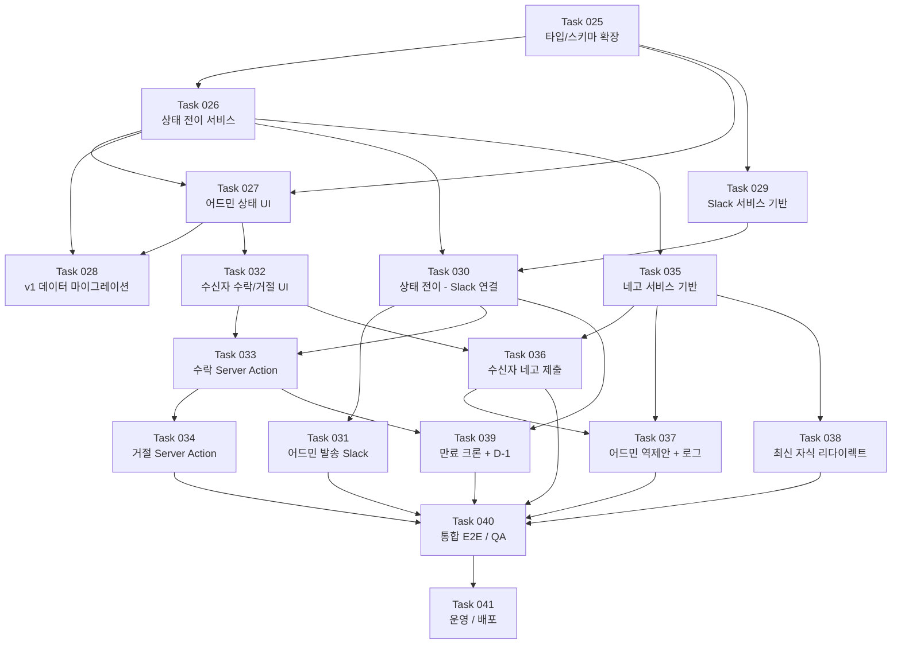

# 노션 기반 견적서 관리 시스템 v2 개발 로드맵

v1(MVP + 고도화, Task 001~024)을 기반으로 **견적서 상태 추적**, **Slack 실시간 알림**, **수신자 수락/거절**, **네고 트리** 기능을 추가하여 거래 템포를 가속하고 협상 히스토리를 추적 가능하게 한다.

## 개요

### v2가 추가하는 것

- **F101 견적서 상태 필드 확장**: 6개 상태(`sent/reviewing/accepted/rejected/negotiating/expired`) + 신규 Notion 필드 7개
- **F102 Slack 알림 파이프라인**: 전용 채널, 이벤트별 개별 메시지, Incoming Webhook
- **F103 수락/거절 버튼**: 수신자 UI + Server Action + 사유 저장
- **F104 네고 트리**: 자식 견적서 생성, `parent_invoice` Relation, 최신 자식 리다이렉트, `floor_price` 가드

### v2가 변경하지 않는 것

- v1에서 구축된 어드민 인증/세션 흐름
- PDF 생성 파이프라인 (`/api/generate-pdf`)
- 기존 Notion Invoice/Items 스키마 필드 (신규 필드만 추가)
- 견적서 URL 구조 (`/invoice/[id]`)

### 범위 외 (v3 이후)

- **F105 카카오톡 공유** — 도메인 등록 이슈 미해결, 우선순위 낮음
- 다국어 견적서, 전자 서명, 템플릿 커스터마이징, 만료 수동 연장

---

## 개발 워크플로우

v1 규칙을 그대로 승계한다.

1. **언어/스타일**: 응답·주석·커밋 메시지 한국어. 변수/함수명 영어 camelCase/PascalCase. 2칸 들여쓰기, `any` 금지, TypeScript strict 유지.
2. **레이어**: Controller(Route/Action) → Service → Repository(Notion) 분리. v1 타입/서비스는 확장만 허용. 기존 시그니처 파괴 금지.
3. **테스트**: API/비즈니스 로직 변경 시 Playwright MCP로 E2E 시나리오 검증 필수.
4. **완료 체크**: `npm run check-all` + `npm run build` 통과 후 완료 처리.
5. **커밋**: 기능 단위 소단위 커밋. 한국어 + Conventional Commits 접두사 (`feat:`, `fix:`, `refactor:` 등).
6. **선후 관계 엄수**: 각 Phase는 이전 Phase 전체 완료 후 착수. 하위 기능은 상위 기능 배포 전 착수 금지.

---

## 개발 단계

### Phase 9: 견적서 상태 모델 확장 및 데이터 마이그레이션

- **Task 025: InvoiceStatus 타입 확장 및 Notion 스키마 필드 정의** ✅ - 완료
  - ✅ `InvoiceStatus` union을 6개 값으로 확장
  - ✅ `Invoice` · `InvoiceItem` 인터페이스에 v2 신규 필드 추가
  - ✅ Notion DB에 7개 신규 Property 실제 추가
  - ✅ Notion 스키마 가이드 문서화

- **Task 026: 상태 전이 서비스 구축** ✅ - 완료
  - ✅ 허용 전이 맵 기반 `transitionStatus()` 구현
  - ✅ 기존 `invoice.service.ts` 경유 연결 (시그니처 유지)
  - ✅ `InvalidTransitionError` 등 커스텀 에러 정의

- **Task 027: 어드민 UI 6개 상태 렌더링/필터 대응** ✅ - 완료
  - ✅ 상태별 색상·라벨 매핑 상수 정의
  - ✅ `StatusBadge` 컴포넌트 6개 상태 대응
  - ✅ 어드민 목록 필터 드롭다운에 전체 상태 노출

- **Task 028: v1 데이터 마이그레이션 (pending/approved → v2 매핑)** ✅ - 완료
  - ✅ 마이그레이션 스크립트 dry-run 모드 실행
  - ✅ 실제 Notion DB 데이터 일괄 전환
  - ✅ 어드민 UI에서 기존 견적서 정상 렌더 확인

### Phase 10: Slack 알림 파이프라인 구축

- **Task 029: Slack 서비스 기반 구축 (webhook client)** ✅ - 완료
  - ✅ `SLACK_WEBHOOK_URL` 환경변수 추가 및 검증
  - ✅ `slack.service.ts` 구현 (실패 시 throw 금지, 로깅 후 no-op)
  - ✅ 이벤트별 메시지 포맷터 구현
  - ✅ 수동 테스트 스크립트로 채널 전송 확인

- **Task 030: 상태 전이 훅에 Slack 이벤트 연결** ✅ - 완료
  - ✅ 상태 전이 성공 후 이벤트 디스패치
  - ✅ 발송/열람/수락/거절 4개 이벤트 Slack 메시지 확인
  - ✅ 열람 전이 idempotent 처리 (중복 전송 방지)

- **Task 031: 어드민 발송 액션에 Slack 발송 이벤트 통합** ✅ - 완료
  - ✅ 발송 Server Action에서 상태 전이 + Slack 이벤트
  - ✅ Slack 메시지에 수신자 링크 포함
  - ✅ Playwright MCP: 발송 플로우 통과 확인

### Phase 11: 수락/거절 플로우 및 수신자 UI

- **Task 032: 수신자용 수락/거절 버튼 UI** ✅ - 완료
  - ✅ 상태별 버튼 노출 규칙 구현 (terminal 상태 시 숨김)
  - ✅ 거절 Dialog — 사유 미입력 시 제출 불가
  - ✅ 모바일 반응형 레이아웃 확인

- **Task 033: 수락 Server Action 및 이벤트 통합** ✅ - 완료
  - ✅ `acceptInvoice()` Server Action 구현
  - ✅ 수락 후 페이지 즉시 `accepted` 반영
  - ✅ Slack "수락" 메시지 1건 수신 확인

- **Task 034: 거절 Server Action + 사유 저장** ✅ - 완료
  - ✅ `rejectInvoice()` Server Action + `reject_reason` Notion 저장
  - ✅ Slack "거절" 메시지에 사유 인용 블록 포함
  - ✅ Playwright MCP: 거절 플로우 통과 확인

### Phase 12: 네고 트리(자식 견적서) 시스템

- **Task 035: 네고 서비스 기반 구축 (invoice-nego.service)** ✅ - 완료
  - ✅ `createChildInvoice()` — `parent_invoice` Relation + `original_unit_price` 보존
  - ✅ `getLatestDescendant()` — 순환 참조 방지 방문 집합 포함
  - ✅ `floor_price` / 최대 회차 가드 구현

- **Task 036: 수신자 네고 제출 UI & Server Action** ✅ - 완료
  - ✅ 품목별 단가 수정 폼 + Zod 검증 (floor_price 차단)
  - ✅ 제출 후 자식 견적서 생성, 부모 `negotiating` 전이
  - ✅ Slack "네고 제출" 메시지 전송 확인

- **Task 037: 어드민 역제안 UI & 네고 로그 모달** ✅ - 완료
  - ✅ 역제안 폼 + 자식 견적서 생성
  - ✅ 네고 로그 모달 — root~leaf 타임라인 (버튼 클릭 열기, 모바일 호환)
  - ✅ 역제안 시 Slack 알림 전송 확인

- **Task 038: 최신 자식 리다이렉트 & URL 전략** ✅ - 완료
  - ✅ 수신자 진입 시 최신 자식으로 redirect
  - ✅ 어드민은 노드별 고정 URL 유지 (리다이렉트 없음)
  - ✅ Playwright MCP: 2단계 네고 후 부모 링크 → leaf 이동 확인

### Phase 13: 만료 크론 · 통합 QA · 배포

- **Task 039: 만료 크론 엔드포인트 & D-1 알림** ✅ - 완료
  - ✅ `CRON_SECRET` 검증 + 만료 대상 일괄 `expired` 전이
  - ✅ D-1 "내일 만료" Slack 알림
  - ✅ 만료 견적서 접근 시 안내 컴포넌트 노출 (액션 버튼 비활성화)

- **Task 040: Playwright MCP 통합 E2E & 회귀 QA** ✅ - 완료
  - ✅ v2 E2E 시나리오 S1/S3/S4/S5/S6 Playwright 검증 (26개 자동화 테스트 통과)
  - ✅ v1 회귀(PDF 다운로드, 링크 복사, 어드민 목록) 통과
  - ✅ 모바일(375)/태블릿(768)/데스크톱(1280) 반응형 레이아웃 확인

- **Task 041: 운영 준비 및 v2 배포** ✅ - 완료
  - ✅ `npm run check-all` + `npm run build` 통과
  - ✅ 운영 문서 작성 (`docs/guides/ops-v2.md`) — Slack/크론/롤백 절차 포함
  - ✅ `.env.example` 신규 생성, ROADMAP v2 완료 처리

---

## 작업별 상세 구현 사항

### Task 025: InvoiceStatus 타입 확장 및 Notion 스키마 필드 정의

**예상 소요 시간**: 3-4시간

**구현 내용**:

- `src/types/invoice.ts` — `InvoiceStatus` union 확장: `'sent' | 'reviewing' | 'accepted' | 'rejected' | 'negotiating' | 'expired'`
- `src/types/invoice.ts` — `Invoice` 인터페이스에 신규 필드 추가: `floorPrice?`, `maxNegoRounds?`, `expiresAt?`, `parentInvoiceId?`, `rejectReason?`, `negoMemo?`
- `src/types/invoice.ts` — `InvoiceItem`에 `originalUnitPrice?` 추가
- `src/lib/constants/notion-schema.ts` (신규) — Notion Property 키 상수화
- `docs/guides/notion-schema-v2.md` (신규) — Notion DB 신규 Property 목록·타입·옵션값 문서화

**완료 기준**:

- `InvoiceStatus` union이 6개 값을 포함하고 `tsc --noEmit` 통과
- 기존 `src/lib/services/invoice.service.ts`의 타입 추론이 깨지지 않음 (컴파일 에러 0)
- Notion DB에 7개 신규 Property 실제 추가 (`expires_at`, `max_nego_rounds`, `parent_invoice`, `reject_reason`, `nego_memo`, `floor_price`, `original_unit_price`)
- `npm run check-all` 통과

**선행 Task**: 없음 (v2의 루트)

---

### Task 026: 상태 전이 서비스 구축

**예상 소요 시간**: 3-4시간

**구현 내용**:

- `src/lib/services/invoice-status.service.ts` (신규)
  - `transitionStatus(invoiceId, from, to, context?)` — 허용 전이 맵 기반 검증 + Notion 업데이트
  - `getAllowedTransitions(current: InvoiceStatus): InvoiceStatus[]`
  - `isTerminal(status: InvoiceStatus): boolean` (accepted / rejected / expired)
- `src/lib/errors/invoice-status.error.ts` (신규) — `InvalidTransitionError`
- `src/lib/services/invoice.service.ts` — Notion 상태 업데이트 호출부를 신규 서비스 경유로 교체 (기존 함수 시그니처 유지)

**완료 기준**:

- 허용 전이 매트릭스가 PRD-v2 F101 명세와 1:1 일치 (`발송됨→검토중→수락/거절/네고중`, 만료는 어디서나 진입)
- 비허용 전이 시 `InvalidTransitionError` 발생
- 기존 v1 어드민 상태 변경 흐름 회귀 없음
- `any` 미사용, strict 통과

**선행 Task**: 025

---

### Task 027: 어드민 UI 6개 상태 렌더링/필터 대응

**예상 소요 시간**: 2-3시간

**구현 내용**:

- `src/lib/constants/invoice-status.ts` (신규) — 상태별 label/color 매핑 상수
- `src/app/admin/invoices/_components/StatusBadge.tsx` (수정) — 6개 상태 색상 매핑
- `src/app/admin/invoices/page.tsx` — 필터 드롭다운 옵션에 6개 상태 추가
- `src/app/admin/invoices/[id]/page.tsx` (신규 또는 수정) — 상세 화면 상태 표시

**완료 기준**:

- 6개 상태가 목록에서 색상·라벨로 식별 가능
- 필터 드롭다운에 6개 상태 모두 노출
- v1 어드민 목록 페이지 회귀 없음 (Playwright MCP로 기존 시나리오 재확인)
- `npm run check-all` 통과

**선행 Task**: 025, 026

---

### Task 028: v1 데이터 마이그레이션 (pending/approved → v2 매핑)

**예상 소요 시간**: 2-3시간

**구현 내용**:

- `scripts/migrate-status-v1-to-v2.ts` (신규) — `pending → sent`, `approved → accepted`, `rejected → rejected` 매핑, dry-run/실행 2단계 모드
- `docs/guides/migration-v2.md` (신규) — 실행 절차, 결과 확인 방법, 롤백 방법

**완료 기준**:

- dry-run 출력이 변환 대상 건수와 일치
- 실제 실행 후 Notion DB에 `pending` / `approved` 상태 0건
- 어드민 UI에서 기존 견적서가 신규 상태 체계로 정상 렌더
- 롤백 절차 문서화

**선행 Task**: 025, 026, 027

---

### Task 029: Slack 서비스 기반 구축 (webhook client)

**예상 소요 시간**: 2-3시간

**구현 내용**:

- `.env.example` — `SLACK_WEBHOOK_URL=` 추가
- `src/lib/env.ts` (수정) — `SLACK_WEBHOOK_URL` 런타임 검증 (미설정 시 경고 로그·no-op)
- `src/lib/services/slack.service.ts` (신규)
  - `sendSlackMessage(payload: SlackPayload): Promise<{ ok: boolean }>`
  - 실패 시 throw 금지 — 로깅 후 `{ ok: false }` 반환
- `src/lib/services/slack-messages.ts` (신규) — 이벤트별 메시지 포맷터 (`sent` / `viewed` / `accepted` / `rejected` / `nego` / `expiring` / `expired`)

**완료 기준**:

- `SLACK_WEBHOOK_URL` 미설정 시 앱이 죽지 않고 경고 로그만 출력
- 수동 스크립트로 테스트 메시지 Slack 채널 전송 성공
- 네트워크 실패 시 상위 로직에 throw 전파 안 함
- `any` 미사용

**선행 Task**: 025 (타입 의존)

---

### Task 030: 상태 전이 훅에 Slack 이벤트 연결

**예상 소요 시간**: 2-3시간

**구현 내용**:

- `src/lib/services/invoice-status.service.ts` — `transitionStatus` 성공 직후 Slack 이벤트 디스패치 (fire-and-forget, 실패 swallow)
- `src/lib/services/invoice-events.ts` (신규) — 이벤트 → Slack 포맷터 매핑
- `src/app/invoice/[id]/page.tsx` — 최초 열람 시 `sent → reviewing` 전이 트리거 (Server Component 또는 Server Action)

**완료 기준**:

- 발송·열람·수락·거절 각 이벤트가 Slack 채널에서 개별 메시지로 확인
- Slack 전송 실패해도 상태 전이가 Notion에 커밋됨
- 동일 견적서의 열람 전이가 중복 전송되지 않음 (idempotent)
- `npm run check-all` 통과

**선행 Task**: 026, 029

---

### Task 031: 어드민 발송 액션에 Slack 발송 이벤트 통합

**예상 소요 시간**: 1-2시간

**구현 내용**:

- `src/app/admin/invoices/[id]/actions.ts` — 발송 Server Action에서 상태 `sent` 전이 + Slack 이벤트
- `src/app/admin/invoices/_components/SendButton.tsx` (신규 또는 수정)
- `src/lib/services/slack-messages.ts` — "발송" 메시지에 수신자 링크 포함

**완료 기준**:

- 어드민에서 발송 클릭 → 상태 `sent` 전환, Slack 메시지 1건 수신
- Slack 메시지에 견적서 제목·금액·수신자 링크 포함
- Playwright MCP: 발송 플로우 통과

**선행 Task**: 030

---

### Task 032: 수신자용 수락/거절 버튼 UI

**예상 소요 시간**: 2-3시간

**구현 내용**:

- `src/app/invoice/[id]/_components/RecipientActions.tsx` (신규) — 수락·거절 버튼 영역
- `src/app/invoice/[id]/_components/RejectReasonDialog.tsx` (신규) — 사유 필수 입력 Dialog (Zod 검증)
- `src/app/invoice/[id]/page.tsx` — `isTerminal` 상태일 때 버튼 영역 숨김

**완료 기준**:

- 상태별 노출 규칙 준수 (`sent`/`reviewing`/`negotiating` → 버튼 노출, `accepted`/`rejected`/`expired` → 숨김)
- 거절 Dialog에서 사유 미입력 시 제출 불가
- 모바일(375px) 반응형 레이아웃 확인
- `any` 미사용

**선행 Task**: 027

---

### Task 033: 수락 Server Action 및 이벤트 통합

**예상 소요 시간**: 1-2시간

**구현 내용**:

- `src/app/invoice/[id]/actions.ts` (신규 또는 수정) — `acceptInvoice(id)` Server Action
- `src/lib/services/invoice-status.service.ts` — `reviewing → accepted` 전이 경로 검증
- `src/lib/cache.ts` — 수락 후 해당 캐시 키 무효화 (`revalidateTag`)

**완료 기준**:

- 수락 후 페이지가 즉시 `accepted` 상태로 반영
- Slack "수락" 메시지 1건 수신
- 이미 terminal 상태에서 재요청 시 `InvalidTransitionError`로 안전 처리
- `npm run check-all` 통과

**선행 Task**: 030, 032

---

### Task 034: 거절 Server Action + 사유 저장

**예상 소요 시간**: 1-2시간

**구현 내용**:

- `src/app/invoice/[id]/actions.ts` — `rejectInvoice(id, reason)` Server Action
- `src/lib/services/invoice.service.ts` — `reject_reason` Notion Rich Text 업데이트
- `src/lib/services/slack-messages.ts` — "거절" 메시지에 사유 인용 블록 추가
- `src/app/admin/invoices/[id]/page.tsx` — 거절 사유 표시 영역

**완료 기준**:

- 사유가 Notion `reject_reason`에 저장됨
- Slack 메시지에 사유가 표시됨
- 어드민 상세 화면에서 거절 사유 확인 가능
- Playwright MCP: 거절 플로우 통과

**선행 Task**: 033

---

### Task 035: 네고 서비스 기반 구축 (invoice-nego.service)

**예상 소요 시간**: 3-4시간

**구현 내용**:

- `src/lib/services/invoice-nego.service.ts` (신규)
  - `createChildInvoice(parentId, patch)` — `parent_invoice` Relation 설정, `original_unit_price` 자동 보존
  - `getLatestDescendant(rootId)` — 최신 자식 조회 (방문 집합 + 최대 깊이 가드, 순환 참조 방지)
  - `assertFloorPrice(items, proposed)` — `floor_price` 미만 차단
  - `assertNegoRoundsLimit(rootId)` — `max_nego_rounds` 초과 차단
- `src/types/invoice.ts` — `NegoChain` 보조 타입

**완료 기준**:

- 자식 생성 시 `parent_invoice`·`original_unit_price` 올바르게 설정
- `floor_price` 위반 시 명확한 에러 메시지
- 최대 회차 초과 시 에러
- 순환 참조 가드 동작 (parent가 현재 노드의 자손이면 거부)
- `any` 미사용, strict 통과

**선행 Task**: 026

---

### Task 036: 수신자 네고 제출 UI & Server Action

**예상 소요 시간**: 3-4시간

**구현 내용**:

- `src/app/invoice/[id]/_components/NegotiationForm.tsx` (신규) — React Hook Form + Zod, 품목별 단가 수정, 합계 자동 재계산
- `src/app/invoice/[id]/actions.ts` — `proposeNegotiation(id, items, memo)` Server Action
- 제출 성공 후 새 자식 견적서 URL로 redirect
- 가격 UI: 원본가(취소선) + 현재가 표시

**완료 기준**:

- 품목별 단가 수정 가능, 합계 자동 재계산
- 제출 시 부모 `negotiating` 전이, 자식 `sent` 생성
- `floor_price` 위반은 폼 단 검증에서도 차단
- Slack "네고 제출" 메시지 전송

**선행 Task**: 035, 032

---

### Task 037: 어드민 역제안 UI & 네고 로그 모달

**예상 소요 시간**: 3-4시간

**구현 내용**:

- `src/app/admin/invoices/[id]/_components/CounterProposalForm.tsx` (신규) — 역제안 폼
- `src/app/admin/invoices/[id]/actions.ts` — `counterPropose(id, items, memo)` Server Action
- `src/app/admin/invoices/[id]/_components/NegotiationLogModal.tsx` (신규) — 전체 체인 타임라인, 아이콘 버튼 클릭으로 열기 (마우스 오버 금지, 모바일 호환)
- 로그 표기: `1차: 50,000원 [우리 제안]` / `2차: 45,000원 [고객 제안]` 형식

**완료 기준**:

- 역제안 시 새 자식 견적서 생성 및 Slack 알림
- 네고 로그 모달에서 root~leaf 타임라인이 주체 라벨과 함께 표시
- 버튼 클릭으로 모달 열기, 키보드(ESC) 닫기, 포커스 트랩
- `max_nego_rounds` 오버라이드 입력 시 Notion 갱신

**선행 Task**: 035, 036

---

### Task 038: 최신 자식 리다이렉트 & URL 전략

**예상 소요 시간**: 1-2시간

**구현 내용**:

- `src/app/invoice/[id]/page.tsx` — 진입 시 `getLatestDescendant` 호출, 현재 노드가 최신이 아니면 `redirect(latest.id)` (단일 리다이렉트, 서버에서 leaf 계산 완료 후 전달)
- `src/lib/services/invoice-nego.service.ts` — 조회 캐시 키 설계
- 어드민 `src/app/admin/invoices/[id]/page.tsx` — 리다이렉트 없이 해당 노드 그대로 표시

**완료 기준**:

- 부모 URL 접근 → 최신 자식 URL로 308/307 리다이렉트 (체인 1회 이내)
- 어드민은 노드별 고정 URL 유지
- Playwright MCP: 2단계 네고 후 부모 링크가 leaf로 이동
- `npm run check-all` 통과

**선행 Task**: 035

---

### Task 039: 만료 크론 엔드포인트 & D-1 알림

**예상 소요 시간**: 2-3시간

**구현 내용**:

- `src/app/api/cron/expire/route.ts` (신규) — `CRON_SECRET` 헤더 검증(불일치 시 401), 만료 대상 일괄 `expired` 전이, D-1 대상 Slack "내일 만료" 알림
- `vercel.json` — `crons` 설정 (하루 1회, 예: `0 0 * * *`)
- `.env.example` — `CRON_SECRET=` 추가
- `src/lib/services/invoice.service.ts` — `findExpiringAt(date)`, `findExpiredBefore(date)` 추가
- `src/app/invoice/[id]/_components/ExpiredNotice.tsx` (신규) — 만료 안내 페이지 (재발행 문의 안내, 모든 액션 비활성화)

**완료 기준**:

- `CRON_SECRET` 미설정/불일치 시 401 반환
- 수동 호출로 만료 대상 1건을 `expired` 전이 + Slack 알림 확인
- D-1 대상에 "내일 만료" Slack 메시지 전송
- 만료된 견적서 접근 시 `ExpiredNotice` 노출, 수락·거절·네고 버튼 전부 비활성화

**선행 Task**: 030, 033

---

### Task 040: Playwright MCP 통합 E2E & 회귀 QA

**예상 소요 시간**: 3-4시간

**구현 내용**:

- `tests/e2e/v2/invoice-flow.spec.ts` (신규) — 아래 E2E 시나리오 S1~S9
- 반응형 캡처: 모바일(375) / 태블릿(768) / 데스크톱(1280)
- v1 회귀 시나리오: PDF 다운로드, 링크 복사, 어드민 목록

**완료 기준**:

- E2E 시나리오 S1~S9 모두 통과 (상세 내용은 아래 고도화 체크리스트 참조)
- v1 회귀 3개 시나리오 통과
- 모바일·태블릿·데스크톱 레이아웃 깨짐 없음 확인

**선행 Task**: 031, 034, 036, 037, 038, 039

---

### Task 041: 운영 준비 및 v2 배포

**예상 소요 시간**: 1-2시간

**구현 내용**:

- Vercel 환경변수 등록: `SLACK_WEBHOOK_URL`, `CRON_SECRET`
- `docs/guides/ops-v2.md` (신규) — Slack 채널/웹훅/크론/수동 트리거 절차, 롤백 방법
- `README.md` — v2 기능 목록 갱신
- 배포 후 스모크 테스트 체크리스트 수행

**완료 기준**:

- `npm run check-all` + `npm run build` 통과
- 프로덕션에서 발송 → 수락 스모크 테스트 성공
- 크론 첫 1회 정상 실행 로그 확인
- 운영 문서에 롤백 절차 기록

**선행 Task**: 040

---

## 기술적 의존성 관계

---

## 고도화/품질 체크리스트

### Playwright MCP E2E 시나리오

- [ ] **S1 발송→검토중**: 어드민 발송 → 수신자 최초 접속 → 상태 `reviewing`, Slack "열람" 메시지 1건 수신
- [ ] **S2 수락**: 수신자 수락 클릭 → 상태 `accepted`, 버튼 영역 숨김, Slack "수락" 메시지 1건
- [ ] **S3 거절(사유 필수)**: 사유 공란 제출 차단 → 사유 입력 제출 → 상태 `rejected`, 사유가 어드민 상세에 표시
- [ ] **S4 네고 제출**: 단가 수정 제출 → 자식 견적서 생성, 부모 `negotiating`, 자식 `sent`, Slack "네고 제출" 알림
- [ ] **S5 역제안**: 어드민이 자식에 대해 역제안 → 손자 견적서 생성, 네고 로그 모달에서 체인 확인
- [ ] **S6 최신 자식 리다이렉트**: 부모 URL 접근 → leaf URL로 이동 (리다이렉트 체인 1회 이내)
- [ ] **S7 만료 안내**: 크론 수동 호출로 `expired` 전이 → 수신자가 기존 URL 접근 시 만료 안내 페이지
- [ ] **S8 floor_price 가드**: 바닥가 미만 네고 제출 시 폼 레벨 + 서버 레벨 양쪽에서 모두 차단
- [ ] **S9 최대 회차 초과**: 상한 도달 시 UI에서 네고 버튼 비활성화 + 서버 검증 동작

### v1 회귀 방지

- [ ] PDF 다운로드 정상 (한글 폰트, 금액 포맷)
- [ ] 수신자 링크 복사 기능
- [ ] 어드민 목록 필터/정렬
- [ ] 기존 견적서(마이그레이션 대상) 렌더링 정상
- [ ] `unstable_cache` 키 충돌 없음

### 접근성 / 반응형

- [ ] 모바일(375) / 태블릿(768) / 데스크톱(1280)에서 수락·거절·네고 폼 레이아웃 깨짐 없음
- [ ] 거절 Dialog · 네고 로그 Modal 키보드 네비게이션 (포커스 트랩, ESC 닫기)
- [ ] 버튼·배지 대비비 WCAG AA
- [ ] 폼 에러 메시지 `aria-live` 적용

### 환경변수 / 보안

- [ ] `SLACK_WEBHOOK_URL` 미설정 시 앱이 죽지 않고 경고 로그만 출력
- [ ] `CRON_SECRET` 미설정/불일치 시 크론 엔드포인트 401 반환
- [ ] `.env.example`에 모든 신규 env 반영
- [ ] Slack 메시지에 내부 토큰/PII 누출 없음

---

## 위험 요소 및 완화책

| #   | 위험                                                   | 영향                                           | 완화책                                                                                                                                                                                   |
| --- | ------------------------------------------------------ | ---------------------------------------------- | ---------------------------------------------------------------------------------------------------------------------------------------------------------------------------------------- |
| R1  | **Notion 스키마 변경 실패** (속성명 오타, 타입 불일치) | 전체 v2 기능 불능                              | Task 025에서 Property 키 상수화 + 가이드 문서. 스키마 변경 후 read-only 스모크 스크립트로 1건 fetch 검증 후 Task 026 착수                                                                |
| R2  | **마이그레이션 부작용** (데이터 손실, 매핑 누락)       | 기존 견적서 상태 깨짐                          | Task 028을 dry-run 필수 2단계로 구성. 변환 전 Notion DB 내보내기(백업). 롤백 스크립트 동시 작성                                                                                          |
| R3  | **Slack Webhook 실패 시 상태 전이 차단**               | 기능 전면 장애                                 | `slack.service`는 throw 금지 정책. `transitionStatus`는 Slack 결과에 무관하게 Notion 업데이트를 우선 커밋. 실패는 서버 로그에만 기록                                                     |
| R4  | **동시성**: 두 사용자가 동시에 수락/거절/네고 제출     | 상태 중복 전이                                 | 낙관적 체크 — `transitionStatus`에서 현재 상태가 기대값과 다르면 `InvalidTransitionError`. 락/큐는 v3 범위                                                                               |
| R5  | **Vercel Cron 미동작**                                 | 만료 자동화 실패                               | `/api/cron/expire`를 `CRON_SECRET`으로 수동 호출 가능하게 설계. 운영 문서에 `curl` 예시 기재. 크론 성공/실패 요약을 Slack에 매회 전송                                                    |
| R6  | **`parent_invoice` 순환 참조**                         | 무한 리다이렉트, getLatestDescendant 무한 루프 | Task 035 `createChildInvoice`에서 parent 후보가 현재 노드의 자손이면 거부. `getLatestDescendant`에 방문 집합 + 최대 깊이 가드(50). 리다이렉트는 서버에서 leaf 계산 완료 후 단일 redirect |
| R7  | **floor_price 검증 우회**                              | 바닥가 이하 제안 저장                          | 서버(`assertFloorPrice`)와 클라이언트(Zod) 이중 검증. 서버 검증을 단일 신뢰원으로 취급                                                                                                   |
| R8  | **캐시 정합성** (`unstable_cache` stale)               | 상태 전이 후 구버전 노출                       | 상태 변경 Server Action 말미에 `revalidateTag`/`revalidatePath` 일괄 호출                                                                                                                |

---

## 성공 지표

- [ ] **SI-1** 6개 상태(`sent/reviewing/accepted/rejected/negotiating/expired`)가 Notion `Select`에 등록되고 어드민 대시보드에 정확히 렌더링된다
- [ ] **SI-2** 수신자 링크 최초 조회 시 `발송됨 → 검토중` 자동 전이 + Slack 알림 1건이 발생한다
- [ ] **SI-3** 수락 클릭 시 Notion 상태 업데이트 + Slack 알림 + 수신자 화면 전환이 이루어진다
- [ ] **SI-4** 거절 시 사유가 반드시 Notion에 저장되고 어드민 UI에서 확인 가능하다
- [ ] **SI-5** `floor_price` 이하 네고 제출이 UI와 서버 양쪽에서 모두 차단된다
- [ ] **SI-6** 역제안 시 자식 견적서가 생성되고, 기존 링크 접속이 최신 자식으로 리다이렉트된다
- [ ] **SI-7** 네고 로그 모달이 버튼 클릭으로 열리고 모바일에서 정상 동작한다
- [ ] **SI-8** 만료 크론이 `expires_at` 도달 견적서를 `expired`로 전환하고, 6일차에 "내일 만료" Slack 알림을 발송한다
- [ ] **SI-9** v1 기능(PDF 다운로드, 링크 복사, 어드민 목록) 전부 회귀 없이 동작한다

---

**📝 문서 버전**: v2.0
**📅 최종 업데이트**: 2026-04-16
**📊 진행 상황**: Phase 9 착수 전 (0 / 17 Tasks 완료 - 0%)

| Phase                                                  | 상태    | 완료/전체 |
| ------------------------------------------------------ | ------- | --------- |
| Phase 9 · 견적서 상태 모델 확장 및 데이터 마이그레이션 | ⬜ 대기 | 0/4       |
| Phase 10 · Slack 알림 파이프라인 구축                  | ⬜ 대기 | 0/3       |
| Phase 11 · 수락/거절 플로우 및 수신자 UI               | ⬜ 대기 | 0/3       |
| Phase 12 · 네고 트리(자식 견적서) 시스템               | ⬜ 대기 | 0/4       |
| Phase 13 · 만료 크론 · 통합 QA · 배포                  | ⬜ 대기 | 0/3       |

> v1 로드맵(Phase 1~8, Task 001~024)은 `docs/roadmaps/ROADMAP_v1.md` 참조.
> F105(카카오톡 공유)는 v3 이관 — 도메인 등록 이슈 미해결.
